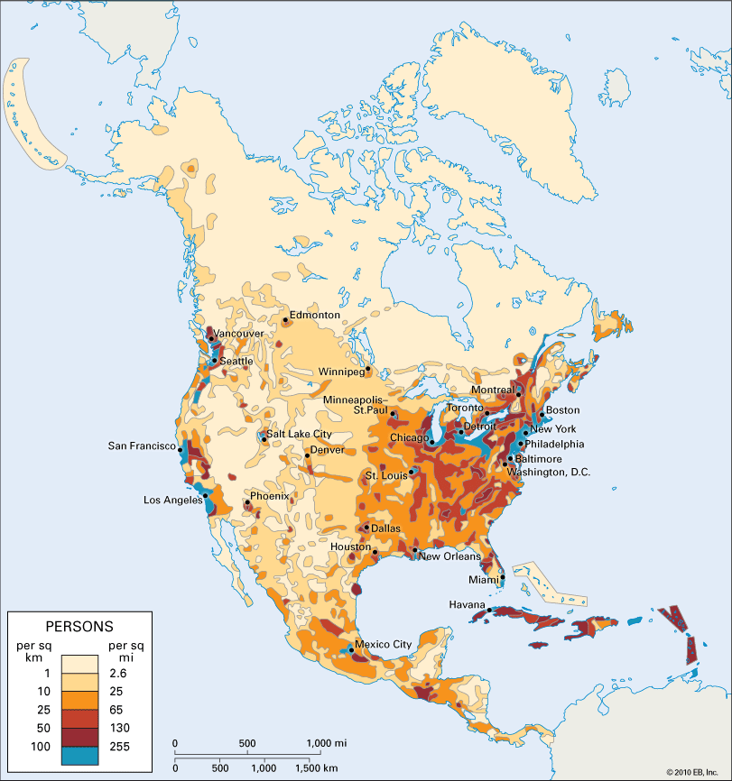

# Highload Indeed

## Содержание
* ### [1. Тема, целевая аудитория](#1)
* ### [2. Расчет нагрузки](#2)
* ### [3. Глобальная балансировка нагрузки](#3)
* ### [ Список источников ](#sources)

## 1. Тема и целевая аудитория 

Indeed — всемирный сервис по поиску работы.

### Целевая аудитория

Трудоспособная часть населения, HR-специалисты

Распределение пользователей по странам:

Демография аудитории:

### Продуктовый функционал
* Поиск вакансий
* Поиск соискателей
* Отклик на вакансию
* Создание вакансий
* Создание/обновление резюме

Основной технической сложностью сервиса является поиск по большому количеству резюме соискателей (245M) и вакансий компаний (533K) в БД. При поиске сотруднкиов, как правило, HR-специалисты используют следующие фильтры: город, режим работы, тип занятости, профессия, должность, опыт работы, желаемый уровень дохода. Соотвественно необходимо обеспечить эффективный поиск в БД резюме соискателей с учетом применения различных фильтров.

### Аналоги
* [myworkdayjobs.com](https://workday.wd5.myworkdayjobs.com/Workday)
* [www.linkedin.com](https://www.linkedin.com)
* [hh.ru](https://hh.ru/)

## 2. Расчет нагрузки 

### Продуктовые метрики
* DAU: 21M
* MAU: 350M
* Количество компаний: 14.6K
* Количество доступных вакансий: 533K
* Количество резюме: 245M
* Добавление новых вакансий за месяц: 9.2М
* Создание/обновление резюме в месяц: 8М
* Среднее время на сайте: 00:06:32

### Технические метрики

Для пересчета продуктовых метрик в технические необходимо ввести некоторые допущения/предположения об сценарии использования сервиса.  
Сперва положим, что из 21M ежедневых пользователей, 100 000 являются HR-специалистами, а остальные, соотвестенно, соискателями. 
Теперь введем следующие предположения:
- соискатель в среднем в день просматривает 3-4 страницы листинга вакансий (около 60 вакансий), при этом он читает подробное описание 5 вакансий;
- на одну вакансию поступает 100 откликов в сутки;
- HR-специалист при поиске сотрудника на открытую вакансию совершает 3-5 запросов с различными поисковыми фильтрами, и из найденных резюме просматривает полное описание 20, при этом в день ему необходимо осуществить поиск сотрудников на 10 открытых вакансий.

#### Размер хранилища

Средний размер харанилища соискателя:

| Хранимые данные | Размер |
| --- | --- |
| Персональные данные | `1 КБ` |
| Резюме | `32 KБ` |

Данные пользователей:

> 245 000 000 * (32 KB + 1 KB) = 7710 GB

Средний размер харанилища вакансии:

| Хранимые данные | Размер |
| --- | --- |
| Описание | `32 КБ` |

Данные вакансий:

> 533 000 * 32 KB = 16 GB

Суммарный объем хранилища

> 7710 GB + 16 GB = 7726 GB = 7.55 TB

#### Расчет RPS:

Запросы соискателей по поиску и просмотру вакансий:

> 20 900 000 * (4 + 5) / 86400 =  2177 RPS

Отклики на вакансии:

> 533 000 * 100 / 86400 = 617 RPS

Запросы HR-специлистов:

> 100 000 * 10 * (5 + 20) / 86400 = 289 RPS

За месяц обновляется/создается 8M резюме:

> 8 000 000 / 30 / 86400 = 3 RPS

Суммарный RPS: 

> 2177 + 617 + 289 + 3 = 3086 RPS

#### Расчет сетевого трафика:

Предположим, что средний размер запрашиваемых страниц равен 150 KB

Средний трафик в день на соискателя:

> 20 900 000 * (4 * 150 KB + 5 * 150 KB) / 86400 = 326 562 KBps = 2551 Mbps

Средний трафик в день на HR:

> 100 000 * 10 * (5 * 150 KB + 20 * 150 KB) / 86400 = 43 402 KBps = 339 Mbps 

Суммарный трафик:

> 2551 + 339 = 2890 Mbps = 2.82 Gbps

## 3. Глобальная балансировка нагузки 

### Обоснование расположения ДЦ

| Страна            | Процент пользователей |   RPS    |
|:------------------|:----------------------|:---------|
| США               |          44.53        |   899    |
| Канада            |           9           |   182    |
| Великобритания    |         8.21          |   166    |
| Франция           |         3.82          |   77     |
| Индия             |         3.51          |   71     |

Больше половины аудитории сервиса находится в Северной Америки, всвязи с этим данный регион подвергается наибольшей нагрузке. С учетом плотности населения США выберем: Нью-Йорк, Лос-Анджелес, Маями и Сиэтл. В Канаде целесообразно расположить ДЦ в городе с наибольшим населением - Торонто. Аудитория сервиса, проживающая в западной Канаде будет использовать ДЦ в Сиэтле из-за близкого географического положения. Для наглядности приведена карта с плотностью населения Северной Америки (https://kids.britannica.com/students/assembly/view/166536)

Для европейской части аудитории разумно будет расположить один ДЦ в немецком Франкфурте, а для южной азиатской расположим ДЦ в индийском Мумбаи.

### Схема DNS балансировки

Geo-based DNS разумно использовать для распределенной географической балансировки на уровне стран. 

### Схема Anycast балансировки

Поскольку общий пул резолвер может использоваться на достаточно большую географическую зону, кроме Geo-based DNS для выбора наиболее географически близкого к пользователю сервера будем также применять технологию BGP anycast, позволяющую после резолва DNS в IP-адреса влиять на выбор ДЦ, на который будет сделан запрос. 

## Список использованных источников: 
* https://www.indeed.com/about/
* https://hypestat.com/info/indeed.com
* https://homejobshub.com/indeed-revenue-and-usage-statistics/
* https://www.similarweb.com/website/indeed.com/
* https://www.indeed.com/hire/resources/howtohub/free-vs-sponsored-jobs-on-indeed#:~:text=Since%209.2%20million%20jobs%20are,postings%20can%20lose%20visibility%20quickly.
* https://www.indeed.com/hire/resources/howtohub/how-to-consistently-attract-and-filter-quality-applicants#:~:text=New%20talent%20added%20every%20day,alerts%20for%20new%20resume%20matches.
* https://kids.britannica.com/students/assembly/view/166536
* https://www.indeed.com/lead/timing-matters-in-the-job-search
* https://www.indeed.com/lead/indeed-delivers-65-percent-online-hires
* https://github.com/hiring-lab/job_postings_tracker?tab=readme-ov-file
* https://github.com/hiring-lab/indeed-wage-tracker
